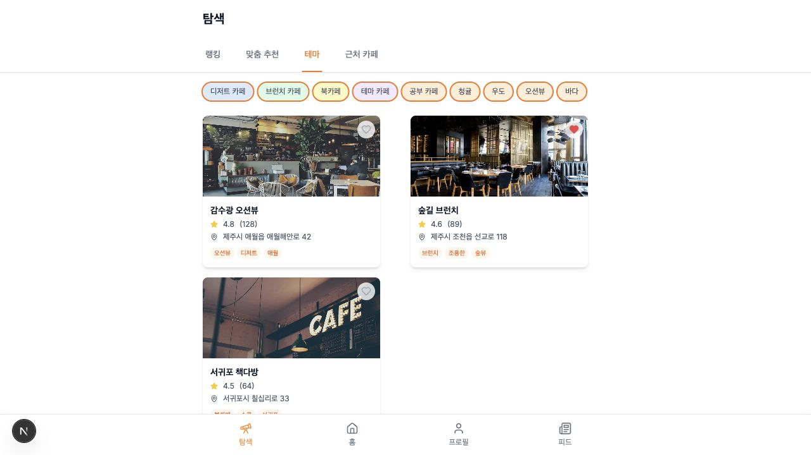
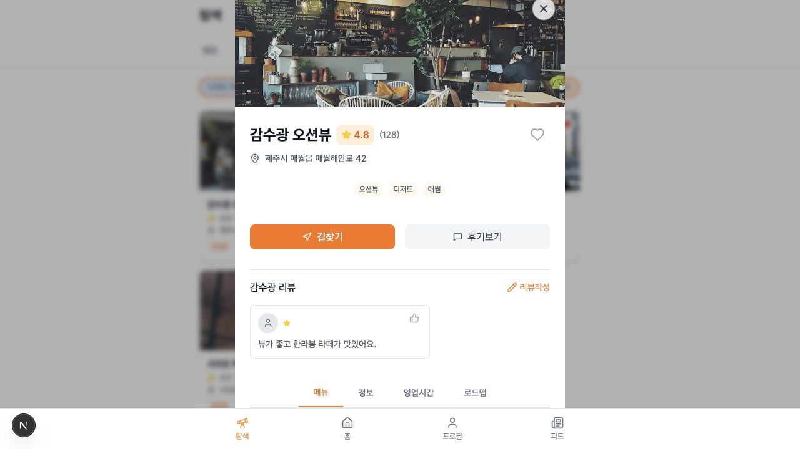

# 🍊 카페감수광

제주도 카페 추천 웹서비스입니다.

리뷰데이터를 카카오맵APi와 크롤링으로 수집하고 분석, 가공해 
사용자에게 선호 키워드와 위치기반으로 맞춤형 카페를 추천합니다.


---

## 🎬 서비스 데모

https://github.com/user-attachments/assets/1a419dd2-216a-434e-a5f4-e7a91fefa290

> 영상이 보이지 않는 환경에서는 [service-demo.mp4](./docs/assets/service-demo.mp4)를 직접 열어 확인할 수 있습니다.

## 🔎 서비스 한눈에 보기

카페감수광은 "제주에서 지금 가기 좋은 카페"를 더 빠르게 고르기 위한 서비스입니다.  
지도와 검색으로 주변 카페를 확인하고, 키워드 랭킹과 테마 추천으로 취향에 맞는 후보를 좁힌 뒤, 상세 화면에서 리뷰와 메뉴, 길찾기까지 이어서 확인할 수 있습니다.

| 홈: 지도와 검색 | 탐색: 테마 추천 |
| --- | --- |
|  |  |

| 카페 상세 | 피드 |
| --- | --- |
|  |  |

## 🧭 핵심 사용자 흐름

```text
카페 리뷰/위치 데이터 수집
  ↓
키워드 추출 및 카페 데이터 정제
  ↓
검색/추천 API 제공
  ↓
사용자는 지도, 키워드, 테마, 위치 기반으로 카페 탐색
  ↓
상세 화면에서 리뷰, 메뉴, 길찾기, 북마크 확인
  ↓
피드와 프로필에서 개인화된 활동 관리
```

---

## 👥 팀원

| 팀장 | 팀원 | 팀원 | 팀원 | 팀원 |
|:---:|:---:|:---:|:---:|:---:|
| [**김민준**](https://github.com/UncleSamsun) | [**김형준**](https://github.com/kimnoca) | [**우상진**](https://github.com/SangJin521) | [**전준영**](https://github.com/Isonade2) | [**정신우**](https://github.com/cupokki) |

---

## ✏️ 기술 스택

### Back-end


### Front-end


### 데이터 수집


### 모니터링/로깅


### Test


### Deploy


### Tool


---

## 📜 프로젝트 목표
- 카카오맵 API 및 웹 크롤링을 활용한 카페 리뷰 및 위치 데이터 수집
- 효율적인 크롤링 및 API 호출을 위한 알고리즘 설계
- KeyBERT 등 NLP 모델을 활용한 리뷰 키워드 자동 추출 및 정제
- 다양한 소스에서 수집된 데이터를 효율적으로 저장·관리하는 데이터 통합 구조 구축
- 분산된 리뷰 데이터를 통합 관리하기 위한 데이터베이스 설계 및 연동
- Spring Batch 기반 스케줄링 시스템을 활용한 카페 키워드 자동 갱신
- 추후 자체 리뷰작성 추천 시스템을 피드백 루프에 반영하여 데이터의 신뢰성을 향상
- ElasticSearch 기반 비정형 데이터 검색 기능 및 맞춤 추천 시스템 구현

---

## 🖥️ 프로젝트 산출물

### 프로젝트 아키텍처


### ERD


### 요구사항 명세서
[**요구사항 명세서**](https://docs.google.com/document/d/1OxWfz5IGUoFpj1_MYIm7_L5nPWUDz5VSTac7fVRSCOc/edit?tab=t.0#heading=h.koem1lbflcn6)

### Api 명세서


### Event Storming
[](https://miro.com/app/board/uXjVI3UePNY=/?moveToWidget=3458764627874125631&cot=14)

---

## 🧩 백엔드 구현 정리

### 담당 서버 역할

카페감수광 백엔드는 제주 카페 탐색 서비스의 핵심 API 서버로, 카페 검색/추천, 리뷰, 북마크, 피드, 인증/OAuth, 사용자 프로필 기능을 제공합니다. 프론트엔드와 크롤링 서버 사이에서 정제된 카페 데이터를 서비스 API로 제공하고, 사용자 행동 데이터를 리뷰/북마크/피드 흐름으로 연결합니다.

### 주요 기능

| 구분 | 기능 |
| --- | --- |
| 인증 | 이메일 회원가입/로그인, JWT 인증, Kakao/Naver/Google OAuth |
| 카페 | 카페 목록/상세 조회, 검색, 자동완성, 수정 제안 |
| 추천 | 위치 기반 추천, 키워드 기반 추천, 사용자 정보 기반 맞춤 추천 |
| 리뷰 | 리뷰 작성/조회/삭제, 리뷰 좋아요 |
| 북마크 | 카페 북마크 추가/삭제/조회 |
| 피드 | 사용자별 피드 조회, 읽음 처리, 전체 읽음 처리, 안 읽은 피드 수 조회 |
| 사용자 | 프로필 조회/수정, 프로필 이미지 변경, 회원 탈퇴/복구 |
| 업로드 | S3 기반 이미지 업로드 |

### 백엔드 기술 스택

| 영역 | 기술 |
| --- | --- |
| Language | Java 17 |
| Framework | Spring Boot 3.4.5 |
| Persistence | Spring Data JPA, MySQL, H2 |
| Search | Spring Data Elasticsearch |
| Cache / Store | Redis |
| Security | Spring Security, JWT |
| OAuth | Kakao, Naver, Google |
| AI | Spring AI, OpenAI Embedding |
| Storage | AWS S3 |
| Docs | Springdoc OpenAPI / Swagger |
| Batch | Spring Batch |
| Test | JUnit 5, Spring Security Test, JaCoCo |

### 도메인 구조

```text
src/main/java/pokssak/gsg/
├── common/              # 공통 응답, 예외, 보안, JWT, 설정, S3
├── batch/               # 카페 데이터 배치 처리
└── domain/
    ├── cafe/            # 카페 조회, 검색, 추천, 메뉴, 키워드
    ├── bookmark/        # 북마크
    ├── review/          # 리뷰 및 리뷰 좋아요
    ├── feed/            # 사용자 피드
    ├── upload/          # 파일 업로드
    └── user/            # 인증, OAuth, 프로필, 사용자 키워드
```

### API 개요

#### Auth

| Method | Endpoint | 설명 |
| --- | --- | --- |
| `POST` | `/api/v1/auth/email-validate` | 이메일 중복 확인 |
| `POST` | `/api/v1/auth/signup` | 일반 회원가입 |
| `POST` | `/api/v1/auth/login` | 일반 로그인 |
| `POST` | `/api/v1/auth/oauth/kakao` | 카카오 OAuth 로그인 |
| `POST` | `/api/v1/auth/oauth/naver` | 네이버 OAuth 로그인 |
| `POST` | `/api/v1/auth/oauth/google` | 구글 OAuth 로그인 |
| `POST` | `/api/v1/auth/oauth/signup` | OAuth 추가 회원가입 |

#### Cafe

| Method | Endpoint | 설명 |
| --- | --- | --- |
| `GET` | `/api/v1/cafes` | 카페 목록 조회 |
| `GET` | `/api/v1/cafes/{cafeId}` | 카페 상세 조회 |
| `GET` | `/api/v1/cafes/search` | 카페 검색 |
| `GET` | `/api/v1/cafes/auto-complete` | 검색어 자동완성 |
| `GET` | `/api/v1/cafes/recommend` | 위치/키워드/하이브리드 추천 |
| `GET` | `/api/v1/cafes/self-recommend` | 사용자 정보 기반 추천 |
| `GET` | `/api/v1/cafes/{cafeId}/reviews` | 카페별 리뷰 조회 |
| `PUT` | `/api/v1/cafes/{cafeId}/suggest` | 카페 정보 수정 제안 |

#### Review / Bookmark / Feed / User

| Method | Endpoint | 설명 |
| --- | --- | --- |
| `GET` | `/api/v1/reviews` | 전체 리뷰 조회 |
| `POST` | `/api/v1/reviews` | 리뷰 작성 |
| `DELETE` | `/api/v1/reviews/{reviewId}` | 리뷰 삭제 |
| `POST` | `/api/v1/bookmarks/{cafeId}` | 북마크 추가 |
| `DELETE` | `/api/v1/bookmarks/{cafeId}` | 북마크 삭제 |
| `GET` | `/api/v1/bookmarks` | 내 북마크 조회 |
| `GET` | `/api/v1/feeds` | 내 피드 조회 |
| `PUT` | `/api/v1/feeds/{feedId}/read` | 피드 읽음 처리 |
| `PUT` | `/api/v1/feeds/read-all` | 모든 피드 읽음 처리 |
| `GET` | `/api/v1/users/profile` | 내 프로필 조회 |
| `PUT` | `/api/v1/users/profile` | 프로필 수정 |
| `PATCH` | `/api/v1/users/profile/image` | 프로필 이미지 수정 |

### 실행 방법

#### 1. 필수 환경

- Java 17
- Docker 또는 로컬 MySQL/Redis/Elasticsearch
- AWS S3 버킷
- OAuth 앱 키
- OpenAI API Key

#### 2. 환경변수 설정

공개 저장소에 민감한 키를 직접 커밋하지 않도록 환경변수 또는 별도 설정 파일로 관리합니다.

```env
SPRING_PROFILES_ACTIVE=local

DB_URL=jdbc:mysql://localhost:3306/gsg
DB_USERNAME=root
DB_PASSWORD=password

REDIS_HOST=localhost
REDIS_PORT=6379

ELASTICSEARCH_HOST=localhost
ELASTICSEARCH_PORT=9200

JWT_SECRET=your_jwt_secret
OPENAI_API_KEY=your_openai_api_key

AWS_S3_BUCKET=your_bucket_name
AWS_ACCESS_KEY=your_access_key
AWS_SECRET_KEY=your_secret_key
AWS_REGION=ap-northeast-2

KAKAO_CLIENT_ID=your_kakao_client_id
NAVER_CLIENT_ID=your_naver_client_id
NAVER_CLIENT_SECRET=your_naver_client_secret
GOOGLE_CLIENT_ID=your_google_client_id
GOOGLE_CLIENT_SECRET=your_google_client_secret
```

#### 3. 애플리케이션 실행

```bash
./gradlew bootRun
```

#### 4. 테스트

```bash
./gradlew test
```

테스트 실행 후 JaCoCo 리포트는 `build/reports/jacoco/test/html/index.html`에서 확인할 수 있습니다.

### 핵심 구현 포인트

#### 도메인 중심 패키지 구조

기능별로 controller, service, repository, dto, entity, exception을 분리했습니다. 카페, 리뷰, 북마크, 피드, 사용자 도메인이 서로 독립적인 책임을 갖도록 구성해 기능 확장 시 변경 범위를 줄였습니다.

#### 인증과 예외 처리

Spring Security와 JWT 필터를 통해 인증 요청을 처리하고, 공통 예외 응답 구조를 사용해 클라이언트가 일관된 형식으로 에러를 받을 수 있도록 했습니다.

#### 검색과 추천 확장성

카페 검색은 Elasticsearch Repository를 통해 확장할 수 있도록 구성했습니다. 추천 API는 위치, 키워드, 사용자 정보 기반 옵션을 분리해 같은 엔드포인트에서도 추천 기준을 유연하게 선택할 수 있습니다.

#### 리뷰/북마크/피드 연계

사용자의 리뷰, 북마크, 피드 알림은 카페 탐색 이후의 재방문 경험을 만들기 위한 기능입니다. 단순 조회 API를 넘어 사용자 행동 데이터를 서비스 흐름에 연결하는 구조를 목표로 했습니다.

### Swagger

애플리케이션 실행 후 아래 주소에서 API 문서를 확인할 수 있습니다.

```text
http://localhost:8080/swagger-ui/index.html
```

### 보안 메모

포트폴리오 또는 공개 저장소에 업로드할 때는 JWT secret, OAuth secret, OpenAI API key, AWS access key, DB password가 코드에 직접 포함되어 있지 않은지 반드시 확인합니다. 민감한 값은 환경변수, 배포 플랫폼 Secret, 또는 로컬 전용 설정 파일로 분리하는 것을 권장합니다.

### 회고

이 프로젝트에서는 검색, 추천, 인증, 사용자 활동 데이터를 하나의 서비스 흐름으로 연결하는 백엔드 구조를 설계했습니다. 특히 도메인별 책임 분리와 공통 예외/응답 구조, JWT 기반 인증, 외부 서비스 연동을 함께 다루며 실제 서비스형 API 서버에 필요한 구성 요소를 경험했습니다.
